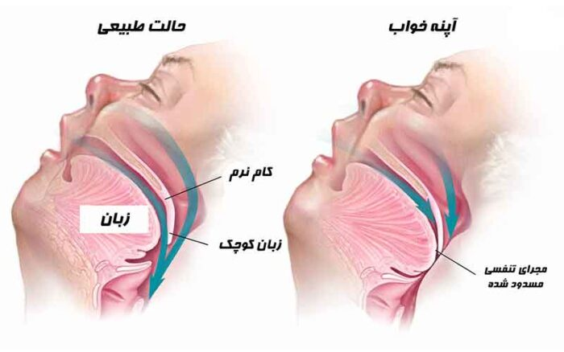
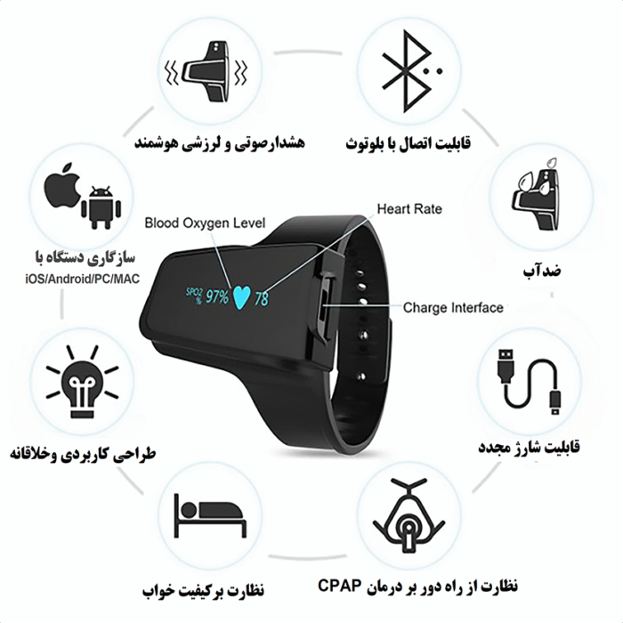
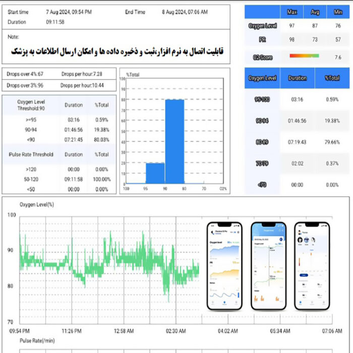
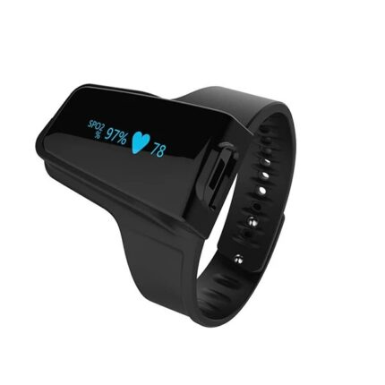

## راز تشخیص آپنه خواب در خانه

آپنه خواب یک اختلال شایع است که می‌تواند خواب آرام شبانه و سلامت روزانه شما را مختل کند. این مشکل که با قطع یا کم‌عمق شدن تنفس در خواب همراه است، ممکن است باعث خستگی مداوم، سردرد صبحگاهی، و حتی خطر بیماری‌های قلبی شود.

خبر خوب این است که با **پالس اکسیمتر مچی Checkme O2 Max**، می‌توانید به‌راحتی در خانه نشانه‌های آپنه خواب را بررسی کنید. در این مقاله، به شما می‌گوییم آپنه خواب چیست، چرا باید جدی گرفته شود، و چگونه دستگاه پیشرفته Checkme O2 Max می‌تواند همراه هوشمند شما برای پایش سلامت باشد.

## آپنه خواب چیست؟

آپنه خواب زمانی رخ می‌دهد که تنفس شما در خواب به‌طور موقت متوقف یا بسیار ضعیف می‌شود. این توقف‌ها که از چند ثانیه تا یک دقیقه طول می‌کشند، می‌توانند بارها در طول شب تکرار شوند.

وقتی تنفس قطع می‌شود، سطح اکسیژن خون کاهش می‌یابد و بدن برای ازسرگیری تنفس، شما را به‌صورت لحظه‌ای بیدار می‌کند. این بیداری‌های کوتاه اغلب به یاد نمی‌مانند، اما خواب شما را مختل کرده و باعث خستگی روزانه می‌شوند.

### انواع آپنه خواب
1.  **آپنه انسدادی خواب (OSA):** شایع‌ترین نوع است و به دلیل انسداد راه‌های هوایی (مثل شل شدن عضلات گلو یا اضافه وزن) رخ می‌دهد.
2.  **آپنه مرکزی خواب:** زمانی اتفاق می‌افتد که مغز سیگنال‌های تنفسی را به عضلات ارسال نمی‌کند.
3.  **آپنه مختلط:** ترکیبی از دو نوع بالا و کمتر شایع است.

## نشانه‌های آپنه خواب؛ این علائم را تجربه می‌کنید؟

* خروپف بلند و مداوم
* احساس خفگی یا نفس‌تنگی در خواب
* خواب‌آلودگی شدید در روز
* سردرد صبحگاهی
* مشکل در تمرکز یا حافظه

> **نکته مهم:** اگر این نشانه‌ها را دارید، وقت آن است که با دستگاهی مثل Checkme O2 Max سلامت تنفسی‌تان را بررسی کنید!

## چرا آپنه خواب را جدی بگیریم؟

آپنه خواب درمان‌نشده می‌تواند مشکلات جدی ایجاد کند:
* **بیماری‌های قلبی:** کاهش اکسیژن خون به قلب فشار می‌آورد.
* **فشار خون بالا:** تنفس نامنظم فشار خون را افزایش می‌دهد.
* **دیابت نوع ۲:** آپنه خواب با مقاومت به انسولین مرتبط است.
* **خطر تصادف:** خواب‌آلودگی می‌تواند رانندگی را خطرناک کند.

علاوه بر این، خروپف شدید می‌تواند خواب شریک زندگی‌تان را مختل کند و روی روابط شخصی تأثیر بگذارد. با Checkme O2 Max، می‌توانید این مشکلات را زود تشخیص دهید و به‌موقع اقدام کنید.

## معرفی پالس اکسیمتر مچی Checkme O2 Max

پالس اکسیمتر مچی **Checkme O2 Max** یک دستگاه پیشرفته و سبک است که سطح اکسیژن خون (SpO2)، ضربان قلب، و حتی حرکات شما را با دقت بالا پایش می‌کند. این دستگاه با طراحی ارگونومیک و حلقه‌ای شکل، راحتی بی‌نظیری را در خواب فراهم می‌کند و تا **۷۲ ساعت** با یک بار شارژ کار می‌کند.

چه بخواهید آپنه خواب را بررسی کنید، چه به پایش مداوم سلامت تنفسی نیاز داشته باشید، Checkme O2 Max انتخابی ایده‌آل است.

### ویژگی‌های برجسته
1.  **پایش مداوم تا ۷۲ ساعت:** با باتری قدرتمند، نیازی به شارژ مکرر ندارید.
2.  **هشدار صوتی و لرزشی هوشمند:** اگر اکسیژن یا ضربان قلب از حد طبیعی خارج شود، با لرزش ملایم و هشدار صوتی شما را آگاه می‌کند تا تنفس‌تان را تنظیم کنید.
3.  **اتصال به اپلیکیشن:** داده‌ها را از طریق بلوتوث به گوشی (iOS/Android) یا کامپیوتر منتقل کنید و گزارش‌های دقیق دریافت کنید.
4.  **دقت بالا:** با ثبت داده‌ها هر ۲ ثانیه، اطلاعات قابل اعتمادی برای شما و پزشک‌تان ارائه می‌دهد.
5.  **طراحی راحت:** سبک (۲۵ گرم) و بدون لغزش، مناسب برای استفاده طولانی‌مدت در خواب.

## چگونه با Checkme O2 Max آپنه خواب را تشخیص دهیم؟

برای بررسی آپنه خواب در خانه، این مراحل ساده را دنبال کنید:

1.  **دستگاه را آماده کنید:** Checkme O2 Max را تهیه کنید. این دستگاه با دقت ±2% برای اکسیژن خون و ±2 bpm برای ضربان قلب، نتایج قابل اعتمادی ارائه می‌دهد.
2.  **نصب راحت:** دستگاه را به مچ دست‌تان ببندید. طراحی ارگونومیک آن باعث می‌شود در خواب اذیت نشوید.
3.  **پایش شبانه:** دستگاه را روشن کنید و بخوابید. Checkme O2 Max تمام شب سطح اکسیژن، ضربان قلب، و حرکات شما را ثبت می‌کند.
4.  **بررسی داده‌ها:** صبح از طریق اپلیکیشن رایگان، گزارش خواب‌تان را ببینید. اگر اکسیژن خون چند بار زیر ۹۰٪ رفته، ممکن است نشانه آپنه خواب باشد.

### نکات مهم برای استفاده
* **محیط مناسب:** دستگاه را در اتاقی با دمای متعادل و نور کم استفاده کنید.
* **تکرار پایش:** برای نتایج دقیق‌تر، چند شب متوالی تست کنید.
* **شارژ باتری:** با یک بار شارژ، تا ۳ روز خیال‌تان راحت است.

## چرا خواب سالم مهم است؟

خواب خوب مثل سوختی برای بدن و ذهن شماست:
* **ترمیم بدن:** سلول‌ها و بافت‌ها در خواب بازسازی می‌شوند.
* **تقویت مغز:** حافظه و تمرکز بهبود می‌یابد.
* **تعادل هورمون‌ها:** خواب روی هورمون‌هایی مثل انسولین اثر می‌گذارد.
* **سیستم ایمنی قوی:** کمبود خواب شما را در برابر بیماری‌ها ضعیف می‌کند.

### راه‌های پیشگیری از آپنه خواب
برای کاهش خطر آپنه خواب:
1.  **وزن‌تان را کنترل کنید:** کاهش وزن راه‌های هوایی را بازتر می‌کند.
2.  **به پهلو بخوابید:** از خوابیدن به پشت پرهیز کنید.
3.  **الکل و سیگار را کنار بگذارید:** این‌ها تنفس را سخت‌تر می‌کنند.
4.  **ورزش کنید:** عضلات تنفسی را تقویت می‌کند.

## نتیجه‌گیری
پالس اکسیمتر مچی **Checkme O2 Max** راهی ساده، دقیق و هوشمند برای پایش سلامت تنفسی در خانه است. با قابلیت پایش ۷۲ ساعته، هشدارهای لرزشی، و اتصال به اپلیکیشن، این دستگاه به شما و پزشک‌تان کمک می‌کند تا آپنه خواب را زود تشخیص دهید و کیفیت خواب‌تان را بهبود ببخشید.

اگر خروپف شدید، خستگی روزانه یا سایر علائم آپنه خواب را دارید، همین حالا با **Checkme O2 Max** اولین قدم را برای سلامتی بردارید.