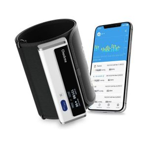

## مقدمه

پایش منظم فشار خون، گامی حیاتی برای حفظ سلامت قلب و عروق است، به‌ویژه برای افرادی که با فشار خون بالا یا پایین دست‌وپنجه نرم می‌کنند. در دنیای تجهیزات پزشکی، فشارسنج‌های عقربه‌ای و دیجیتالی دو گزینه برجسته هستند که هر کدام با ویژگی‌های منحصربه‌فرد خود، نیازهای متفاوتی را برآورده می‌کنند.

آیا به دنبال دستگاهی دقیق برای استفاده حرفه‌ای هستید یا محصولی ساده برای خانه؟ در این راهنمای جامع، با مقایسه دقیق این دو نوع فشارسنج، به شما کمک می‌کنیم تا بهترین انتخاب را برای سبک زندگی خود داشته باشید.

## فشارسنج عقربه‌ای: سنت قابل‌اعتماد

فشارسنج عقربه‌ای یا آنالوگ، یک دستگاه مکانیکی کلاسیک است که با کاف بادی، پوآر (پمپ هوا) و صفحه مدرج با عقربه کار می‌کند. این مدل، همراه با گوشی پزشکی، از گذشته در مطب‌ها و کلینیک‌ها به‌عنوان استاندارد طلایی شناخته شده و هنوز هم به دلیل دقت و دوامش مورد توجه متخصصان است.

### مزایای برجسته
* **دقت بی‌رقیب:** با استفاده صحیح، نتایج بسیار قابل‌اعتمادی ارائه می‌دهد.
* **دوام فوق‌العاده:** ساختار مکانیکی آن با نگهداری مناسب، سال‌ها همراه شما خواهد بود.
* **هزینه اقتصادی:** گزینه‌ای مقرون‌به‌صرفه برای کسانی که به دنبال سرمایه‌گذاری بلندمدت‌اند.

### چالش‌ها
* **نیاز به مهارت:** استفاده از آن نیازمند تجربه برای شنیدن نبض و خواندن عقربه است.
* **وابستگی به کمک:** به‌تنهایی قابل استفاده نیست و نیاز به فرد دیگر دارد.
* **حساسیت به تنظیم:** ممکن است با گذشت زمان نیاز به کالیبراسیون داشته باشد.

## فشارسنج دیجیتالی: فناوری در خدمت راحتی

فشارسنج دیجیتالی، یک نوآوری مدرن است که با بهره‌گیری از فناوری الکترونیکی، فشار خون سیستولیک، دیاستولیک و ضربان قلب را اندازه‌گیری کرده و نتایج را روی نمایشگر نشان می‌دهد. این دستگاه‌ها در دو نوع بازویی و مچی عرضه می‌شوند و به دلیل سادگی و قابلیت‌های هوشمند، انتخابی محبوب برای خانه هستند.

### نقاط قوت
* **استفاده بی‌دردسر:** با فشردن یک دکمه، فرآیند به‌صورت خودکار انجام می‌شود.
* **قابلیت حمل بالا:** مدل‌های مچی، گزینه‌ای ایده‌آل برای سفر و روزمرگی‌اند.
* **ذخیره‌سازی هوشمند:** امکان ثبت چندین اندازه‌گیری برای تحلیل روند سلامت.
* **تشخیص پیشرفته:** برخی مدل‌ها آریتمی قلبی را شناسایی می‌کنند.

### محدودیت‌ها
* **دقت متغیر:** حرکت دست یا بستن نادرست کاف ممکن است دقت را کاهش دهد.
* **هزینه بالاتر:** قیمت آن از مدل‌های عقربه‌ای بیشتر است.
* **وابستگی به انرژی:** نیاز به باتری یا شارژ دارد.

## مقایسه همه‌جانبه: عقربه‌ای در برابر دیجیتال

### ۱. دقت و اعتماد
فشارسنج‌های عقربه‌ای با مکانیزم فیزیکی، دقت بیشتری دارند و به‌عنوان معیار پزشکی شناخته می‌شوند، اما این دقت به مهارت کاربر بستگی دارد. فشارسنج‌های دیجیتالی با پیشرفت‌های اخیر، دقت خوبی ارائه می‌دهند، ولی عوامل محیطی مثل حرکت می‌تواند نتایج را تحت تأثیر قرار دهد.

### ۲. سهولت و تجربه کاربری
دیجیتال‌ها با طراحی خودکار و بدون نیاز به گوشی پزشکی، برای استفاده خانگی عالی‌اند، به‌ویژه برای سالمندان یا افراد مبتدی. در مقابل، عقربه‌ای‌ها نیاز به هماهنگی برای پمپاژ هوا و شنیدن نبض دارند که ممکن است برای همه ساده نباشد.

### ۳. هزینه و نگهداری
عقربه‌ای‌ها با قیمت اولیه پایین و عدم نیاز به باتری، اقتصادی‌اند. دیجیتال‌ها گران‌ترند، ولی قابلیت‌هایی مثل حافظه و اتصال به اپلیکیشن، ارزش آن را توجیه می‌کنند.

## بهترین برندهای بازار

### فشارسنج عقربه‌ایa
* **زنیت (Zenith):** کیفیت ساخت عالی و دقت بالا.
* **ریشتر (Riester):** دوام بالا و مناسب برای حرفه‌ای‌ها.

### فشارسنج دیجیتالی
* **ولو (Wellue):** مدل‌های **Armfit** و **Armfit Plus** با بلوتوث، دقت بالا و قابلیت گرفتن نوار قلب (ECG).
* **امرن (Omron):** فناوری پیشرفته و طراحی کاربرپسند.
* **بیورر (Beurer):** طراحی ارگونومیک با حافظه داخلی.

## راهنمای استفاده بهینه

### برای فشارسنج عقربه‌ای:
1.  بازو را در سطح قلب قرار دهید.
2.  کاف را ۲-۳ سانتی‌متر بالاتر از آرنج ببندید.
3.  با پوآر کاف را باد کنید تا نبض قطع شود، سپس هوا را به‌آرامی تخلیه کنید.
4.  صدای نبض را با گوشی پزشکی شنیده و فشارها را ثبت کنید.

### برای فشارسنج دیجیتالی:
1.  ۳۰ دقیقه قبل از تست، از مصرف کافئین و فعالیت سنگین پرهیز کنید.
2.  بازو را در سطح قلب نگه دارید و کاف را محکم ببندید.
3.  دکمه شروع را فشار دهید و در طول اندازه‌گیری کاملاً بی‌حرکت بمانید.
4.  نتایج را از نمایشگر بخوانید و در اپلیکیشن ذخیره کنید.

## نتیجه‌گیری: کدام را انتخاب کنید؟

انتخاب بستگی به سبک زندگی‌تان دارد. اگر تجربه پزشکی دارید و به دنبال دقت و هزینه کمتر هستید، **عقربه‌ای** مناسب است. اما برای راحتی، استفاده مستقل و بهره‌مندی از فناوری مدرن، **دیجیتال** برتری دارد—به‌ویژه برای سالمندان یا افرادی که تنها زندگی می‌کنند.

با انتخاب هوشمند و استفاده صحیح، سلامت قلب خود را در دست بگیرید و زندگی سالم‌تری بسازید.